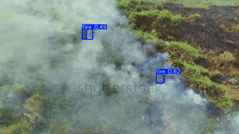
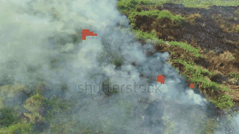
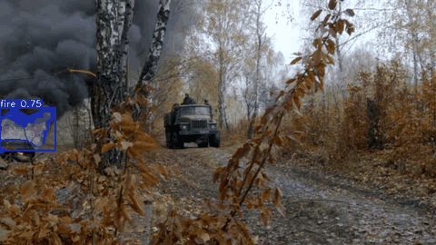
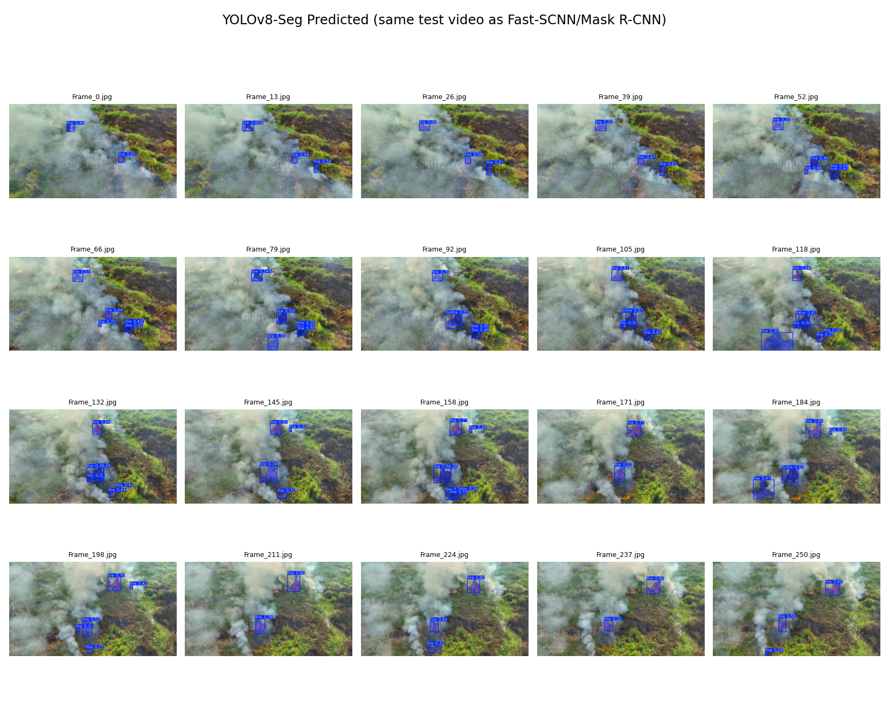
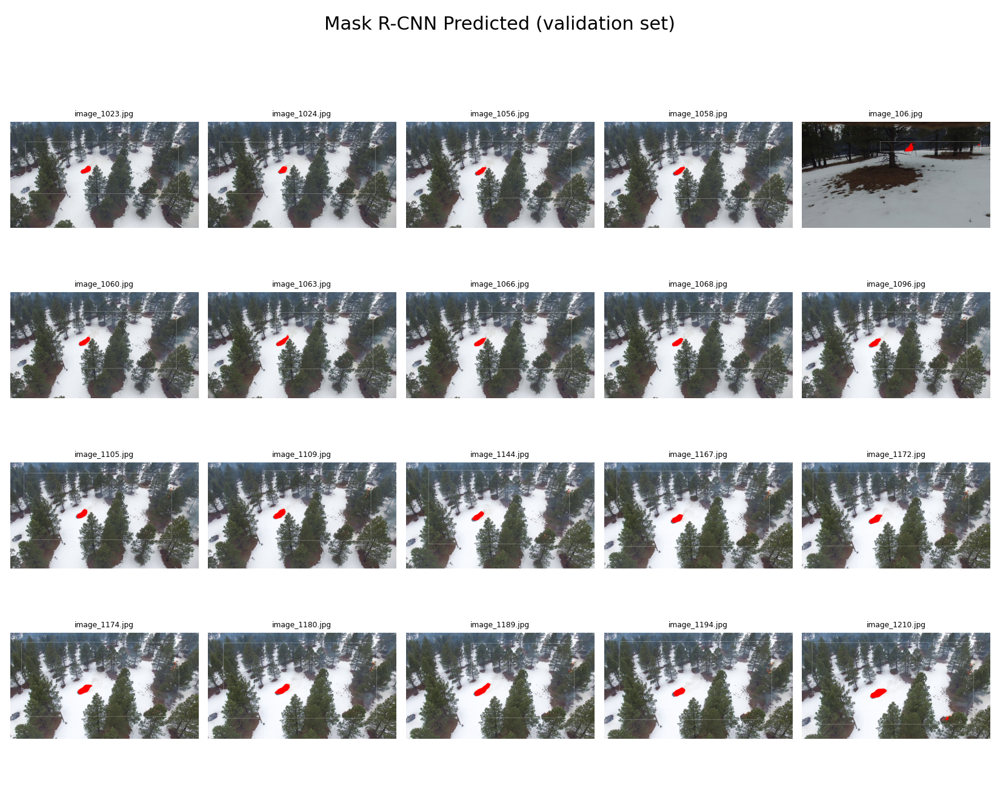
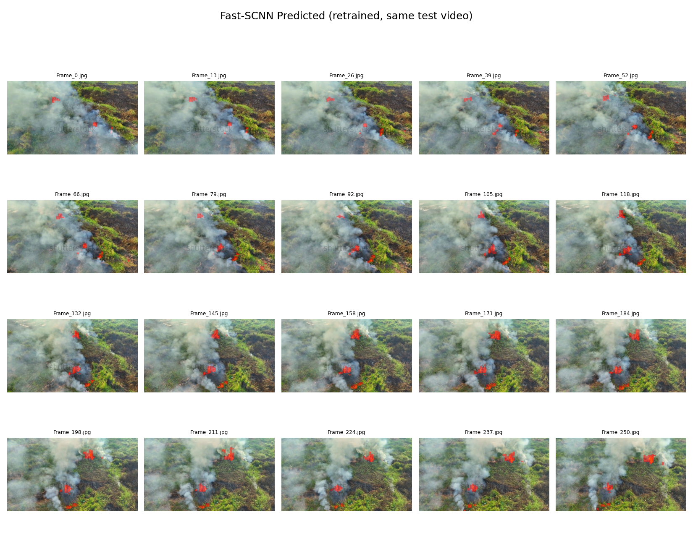

# 화재 영상 세그멘테이션 모델 비교

## 프로젝트 개요

영상에서 화재 영역을 픽셀 단위로 분할하는 세 모델(YOLOv8-Seg, Fast-SCNN, Mask R-CNN)을 비교한 프로젝트입니다. 모델별 정확도와 처리 속도를 측정하고, 원본 영상·정답 마스크·예측 마스크를 함께 확인했습니다.

화재 발생 여부만 분류하는 대신 화재가 나타난 위치와 범위를 마스크로 추정하는 것을 목표로 했습니다. CCTV나 드론처럼 영상이 연속으로 입력되는 환경을 고려해 정확도뿐 아니라 FPS도 비교했습니다.

---

## 비교한 내용

IoU, Precision, Recall, F1-score로 분할 성능을 확인하고, 같은 GPU에서 FPS를 측정했습니다. 수치만으로 확인하기 어려운 오류는 원본·정답·예측 이미지를 나란히 놓고 살펴봤습니다.

---

## 사용된 모델

서로 다른 세그멘테이션 방식을 사용하는 세 모델을 비교했습니다.

### 모델 아키텍처 비교


| 모델         | 주요 특징                           | 아키텍처               | 장점                     |
| ---------- | ------------------------------- | ------------------ | ---------------------- |
| YOLOv8-Seg | One-Stage Detector              | Backbone-Neck-Head | 속도와 정확도의 균형            |
| Fast-SCNN  | 경량화 Semantic Segmentation       | Encoder-Decoder    | 매우 빠른 처리 속도, 저사양 환경 적합 |
| Mask R-CNN | Two-Stage Instance Segmentation | FPN + ResNet       | 정교한 객체 경계 추출, 높은 정확도   |


## 데이터셋 및 전처리

* **데이터 소스:** Roboflow - Fire Seg Part1 & Fire Segment 데이터셋 활용
* **데이터 구성:** 학습 6,262장 / 검증 1,558장 / 테스트 403장 (Fast-SCNN 학습·평가 기준). YOLOv8-Seg는 이 중 테스트 519장, Mask R-CNN은 자체 보유 테스트 201장으로 각각 평가했습니다 
* **전처리:**

  * 모든 모델의 공정한 평가를 위해 **다각형(Polygon) 어노테이션 → 픽셀 단위 마스크(Mask)** 변환 후 사용

### 예시 이미지 

---

## 실험 결과

### 1. 정량적 성능 비교

fire 클래스를 기준으로 한 픽셀 단위 Precision, Recall, F1, IoU입니다. 계산 방법은 `eval_pixel_metrics.py`에 정리했습니다.

| 평가지표          | YOLOv8 (n=519) | Fast-SCNN (n=403) | Mask R-CNN (n=201) |
| ------------- | -------------- | ------------------ | ------------------- |
| **IoU**       | 0.818          | 0.637               | 0.643                |
| **Precision** | 0.887          | 0.690               | 0.853                |
| **Recall**    | 0.913          | 0.892               | 0.723                |
| **F1-Score**  | 0.900          | 0.778               | 0.783                |

- **YOLOv8-Seg**: `fire_seg_yolov8n.pt`를 테스트 이미지 519장에 적용해 측정했습니다.
- **Fast-SCNN**: 원래 저장돼 있던 가중치가 평가 시 모든 픽셀을 배경으로 예측하는 상태여서, 학습 구조를 `models/fast_scnn_fire.py`로 정리하고 Roboflow 데이터 6,262장으로 30 epoch 재학습해서 얻은 결과입니다.
- **Mask R-CNN**: 자체 보유 테스트 이미지 201장에서 측정했습니다.

---

### 2. 실시간 처리 성능 (FPS)

동일한 GPU(RTX 4090)·동일 영상으로 측정한 값입니다.

| 모델         | FPS   |
| ---------- | ----- |
| Fast-SCNN  | 706.7 |
| YOLOv8     | 112.7 |
| Mask R-CNN | 29.9  |

Fast-SCNN > YOLOv8 > Mask R-CNN 순으로 빠릅니다. 정확도(F1)와는 반대 순서에 가까워, 속도와 정확도가 트레이드오프 관계에 있음을 보여줍니다.

### 3. 실제 영상에서의 동작 

모델별 추론 결과를 프레임 단위로 만들어 확인했습니다.

| YOLOv8-Seg | Fast-SCNN (재학습) | Mask R-CNN |
|---|---|---|
|  |  |  |

---

## 테스트 이미지 모델별 Ground Truth vs Prediction 비교

각 모델의 테스트 이미지에서 원본, 정답 마스크, 예측 마스크를 확인합니다.

### YOLOv8-Seg


### Mask R-CNN
정답에는 화재 영역이 두 곳이지만 예측은 한 곳만 검출한 사례가 보입니다. 누락이 발생하는 경향은 Recall 0.723에서도 확인됩니다.



### Fast-SCNN (재학습)
예측 경계가 비교적 거칠고 배경 일부를 화재로 분류하는 사례가 나타났습니다. Precision은 0.690으로 측정됐습니다.



---

## 결과에서 확인한 점

YOLOv8-Seg가 F1 0.900, IoU 0.818로 정확도가 가장 높았고, Fast-SCNN이 706.7 FPS로 속도가 가장 빨랐습니다. Mask R-CNN은 정확도·속도 모두 중간이지만, GT 비교 이미지에서 확인했듯 다중 화재 영역 중 일부를 놓치는 경향(Recall 0.723)이 있습니다.

### 프로젝트 최종 개념도


---

## 주요 파일

- `train_fastscnn_fire.py`: Fast-SCNN 학습
- `eval_pixel_metrics.py`: 모델별 픽셀 단위 지표 계산
- `build_gt_comparison.py`: 원본·정답·예측 비교 이미지 생성
- `build_gifs.py`: 영상 추론 결과 GIF 생성
- `models/fast_scnn_fire.py`: 재학습에 사용한 Fast-SCNN 구조

YOLOv8-Seg는 Ultralytics CLI(`yolo segment train ...`)로 별도 학습했습니다.


## 실행 방법

원본 화재 CCTV/차량 영상과 대용량 학습 데이터는 포함하지 않았습니다. 아래는 재현을 위한 최소 절차입니다.

```bash
pip install -r requirements.txt

# Fast-SCNN 학습 (data/{train,val,test}/{images,masks} 구조 필요)
python train_fastscnn_fire.py

# 세 모델 공통 픽셀 단위 성능 평가
python eval_pixel_metrics.py --model fast_scnn --weights fast_scnn_fire.pth \
    --images data/test/images --labels data/test/masks

# YOLOv8-Seg (Ultralytics)
yolo segment train data=fire_seg.yaml model=yolov8n-seg.pt
```

`data_loader/fire_dataset.py`는 Roboflow에서 내려받은 `Images/`, `Masks/` 폴더 구조를 기준으로 작성되어 있어, 동일한 디렉터리 구조로 데이터를 배치하면 그대로 사용할 수 있습니다.

---


## 참고 문헌

* Ultralytics YOLOv8
* Poudel, R. P. K., et al. *Fast-SCNN: Fast Semantic Segmentation Network*
* He, K., et al. *Mask R-CNN*
* Detectron2
